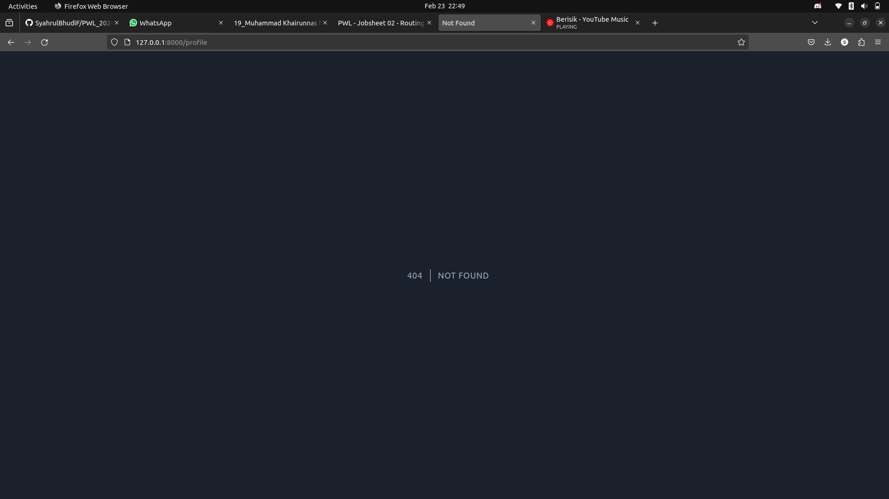
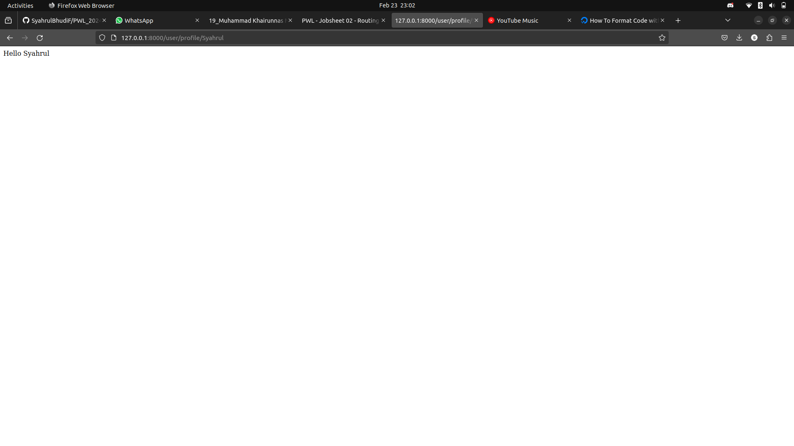

# Jobsheet 2 : ROUTING, CONTROLLER, dan View

> Nama : Syahrul Bhudi Ferdiansyah

> Kelas : TI-2F

> NIM : 2241720167

## Basic Routing

-   Route /hello 
     
    Hasil  
     
    > Disini kita melakukan Routing ke path /hello yang akan menampilkan 'Hello World'. Hal ini dikarenakan kita menulis sintaks Route laravel dengan path /hello dan mereturn nilainya secara langsung yang mana adalah 'Hello World'
-   Route /world 
     
    Hasil 
     
    > Hasilnya sama seperti pada /hello tapi kali ini menggunakan path route /world yang berisi nilai 'World'
-   Route / 
     
    Hasil 
     
-   Route /about 
     
    Hasil 
     

## Route Parameters

-   Route /user/{name} 
     
    Hasil 
     
    > Halaman yang muncul adalah halaman nama saya. Hal ini dikarenakan Route menerima parameter name yang di ambil dari url yang ditulis oleh user
-   Route /posts/{post}/comments/{comment} 
     
    Hasil 
     
    > Hasilnya adalah parameter dalam url tidak hanya 1 berhasil diambil dan ditampilkan ke halaman web
-   Route /articles/{id} 
     
    Hasil 
     

## Optional Parameters

-   Route /user/{name?} 
     
    Hasil 
     
    > Hasilnya adalah tidak ada nama atau tidak ditampilkan. Hal ini dikarenakan menggunakan tanda ? pada akhir {name?} yang mengakibatkan parameter boleh untuk diisi atau tidak diisi dan juga penambahan name = null pada parameter callback untuk menangani ketika tidak ada nilai yang ditangkap jika tidak name = null maka akan mengakibatkan error
    >  
-   Route /user/{name?}', function ($name = 'John) 
     
    Hasil 
    
    > Hasil dari pengubahan tersebut adalah nilai default dari parameter name berubah menjadi John. Jadi ketika url parameter dikosongi maka callback akan langsung meneruskan $name sebagai john
-   Route Name  
     
    Hasil
    
    > Langkah diatas, merupakan code yang kurang benar pada laravel untuk
    > memakai route name, karna route name di pakai untuk mensederhanakan url yang dikira
    > Panjang untuk digunakan redirect atau untuk dipakai di fungsi route lain, berikut merupakan
    > contoh kode yang benar untuk memakai route name: 
    >  
    >  Seperti pada kode diatas, bila kita memanggil Url ’/test’, bukan membuka Url tersebut,
    > melainkan kita bisa me-redirect untuk membuka Url dari route name kita seperti diatas

