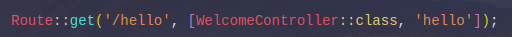

# Jobsheet 2 : ROUTING, CONTROLLER, dan View

> Nama : Syahrul Bhudi Ferdiansyah

> Kelas : TI-2F

> NIM : 2241720167

# Basic Routing
Langkah-langkah Praktikum:<br>
-   Route /hello<br>
    <br>
    Hasil <br>
    <br>
    > Disini kita melakukan Routing ke path /hello yang akan menampilkan 'Hello World'. Hal ini dikarenakan kita menulis sintaks Route laravel dengan path /hello dan mereturn nilainya secara langsung yang mana adalah 'Hello World'
-   Route /world<br>
    <br>
    Hasil<br>
    <br>
    > Hasilnya sama seperti pada /hello tapi kali ini menggunakan path route /world yang berisi nilai 'World'
-   Route /<br>
    <br>
    Hasil<br>
    <br>
-   Route /about<br>
    <br>
    Hasil<br>
    <br>

## Route Parameters
Langkah-langkah Praktikum:<br>
-   Route /user/{name}<br>
    <br>
    Hasil<br>
    <br>
    > Halaman yang muncul adalah halaman nama saya. Hal ini dikarenakan Route menerima parameter name yang di ambil dari url yang ditulis oleh user
-   Route /posts/{post}/comments/{comment}<br>
    <br>
    Hasil<br>
    <br>
    > Hasilnya adalah parameter dalam url tidak hanya 1 berhasil diambil dan ditampilkan ke halaman web
-   Route /articles/{id}<br>
    <br>
    Hasil<br>
    <br>

## Optional Parameters
Langkah-langkah Praktikum:<br>
-   Route /user/{name?}<br>
    <br>
    Hasil<br>
    <br>
    > Hasilnya adalah tidak ada nama atau tidak ditampilkan. Hal ini dikarenakan menggunakan tanda ? pada akhir {name?} yang mengakibatkan parameter boleh untuk diisi atau tidak diisi dan juga penambahan name = null pada parameter callback untuk menangani ketika tidak ada nilai yang ditangkap jika tidak name = null maka akan mengakibatkan error
    > <br>
-   Route /user/{name?}', function ($name = 'John)<br>
    <br>
    Hasil<br>
    
    > Hasil dari pengubahan tersebut adalah nilai default dari parameter name berubah menjadi John. Jadi ketika url parameter dikosongi maka callback akan langsung meneruskan $name sebagai john
-   Route Name<br>
    <br>
    Hasil
    
    > Langkah diatas, merupakan code yang kurang benar pada laravel untuk
    > memakai route name, karna route name di pakai untuk mensederhanakan url yang dikira
    > Panjang untuk digunakan redirect atau untuk dipakai di fungsi route lain, berikut merupakan
    > contoh kode yang benar untuk memakai route name:<br>
    > <br>
    > <br>Seperti pada kode diatas, bila kita memanggil Url ’/test’, bukan membuka Url tersebut,
    > melainkan kita bisa me-redirect untuk membuka Url dari route name kita seperti diatas
# Controller
- Langkah-langkah Praktikum:<br>
    <br>a. Create Controller by terminal<br>
    <br>
    b. WelcomeController<br>
    ```php
        <?php

        namespace App\Http\Controllers;

        use Illuminate\Http\Request;

        class WelcomeController extends Controller
        {
            //
        }
    ```
    c. Untuk mendefinisikan action, silahkan tambahkan function dengan  access public. Sehingga controller di atas menjadi sebagai berikut:<br>
    ```php
        <?php

        namespace App\Http\Controllers;

        use Illuminate\Http\Request;

        class WelcomeController extends Controller
        {
            public function hello(){
                return 'Hello World';
            }
        }
    ```
    d. Setelah sebuah controller telah didefinisikan action, kita dapat menambahkan controller tersebut pada route. Ubah route /hello menjadi seperti berikut: <br>
    <br>
    e. Hasil <br>
    <br>
    >dengan menggunakan controller pada Laravel, kita bisa membuat code
    yang kompleks disbanding dengan basic routing. Hal ini dilandasi karna Laravelmenerapkan konsep MVC (Model-View-Controller), dimana kita bisa memisahkan antar logic code (model), tampilan (view), dan penghubung / perantara (controller), sehingga bisa menerapkan kode yang lebih bersih dan mudah di maintenance. Untuk kode Route /hello diatas menerapkan langsung Controller dari WelcomeController yang memiliki function hello() yang mereturn 'Hello World'

    f. Modifikasi hasil pada praktikum poin 2 (Routing) dengan konsep controller. Pindahkan logika eksekusi ke dalam controller dengan nama PageController.<br>
    <br>
    <br>

    g. Modifikasi kembali implementasi sebelumnya dengan konsep Single Action Controller.Sehingga untuk hasil akhir yang didapatkan akan ada HomeController,AboutController dan ArticleController. Modifikasi juga route yang digunakan.
    <br>
        - HomeController<br>
        <br>
        - AboutController<br>
        <br>
        - ArticleController<br>
        <br>
        - Route <br>
    ```php
        Route::get('/', [HomeController::class]);
        Route::get('/about', [AboutController::class]);
        Route::get('/articles/{id}', [ArticleController::class]);
    ```
## Resource Controller
- Langkah-langkah Praktikum: <br>
    a. Create Resource Controller by terminal<br>
    <br>
    b. Setelah controller berhasil degenerate, selanjutnya harus dibuatkan route agar dapat terhubung dengan frontend. Tambahkan kode program berikut pada file web.php.
    ```php
    Route::resource('photos', PhotoController::class);
    ```
    c. jalankan cek list route (php artisan route:list) akan dihasilkan route berikut ini.
    <br>
    d. Pada route list semua route yang berhubungan untuk crud photo sudah di generate oleh laravel. Jika tidak semua route pada resource controller dibutuhkan dapat dikurangi dengan mengupdate route pada web.php menjadi seperti berikut ini.
    ```php
    Route::resource('photos', PhotoController::class)->only([
        'index', 'show'
    ]);

    Route::resource('photos', PhotoController::class)->except([
        'create', 'store', 'update', 'destroy'
    ]);
    ```
    Hasil Pengecekan Route <br>
    <br>
# View
- Langkah-langkah Praktikum:<br>
    a. Pada direktori app/resources/views, buatlah file hello.blade.php.
    <br>
    b. View tersebut dapat dijalankan melalui Routing, dimana route akan memanggil View sesuai dengan nama file tanpa ‘blade.php’.
    ```php
    Route::get('/greeting', function () {
        return view('hello', ['name' => 'Syahrul Bhudi Ferdiansyah']);
    });
    ```
    c. Hasil <br>
    <br>
    >dengan mengisi kedua pada fungsi helper view yaitu parameter array, kita dapat passing argument pada view kita yaitu ‘hello.blade.php’, sehingga seperti pada Langkah ini kita dapat mencetak isi dari array tersebut<br>

## View dalam Direktori
- Langkah-langkah Praktikum:<br>
    b.<br> <br>
    c. Selanjutnya lakukan perubahan pada route.<br>
    ```php
    Route::get('/greeting', function () {
        return view('blog.hello', ['name' => 'Syahrul Bhudi Ferdiansyah']);
    });
    ```
    d. Hasil <br>
    <br>
    >sama seperti Langkah sebelumnya (hanya query parameter nya di isi dengan value yang berbeda), disini kita berfokus pada view yang disimpan pada folder bertingkat. Pada Laravel, untuk memanggil view “hello” , kita perlu memasukan nama folder seperti “blog.hello”

## Menampilkan view dari Controller
- Langkah-langkah Praktikum: <br>
    a. Buka WelcomeController.php dan tambahkan fungsi baru yaitu greeting.<br>
    <br>
    b. Ubah route /greeting dan arahkan ke WelcomeController pada fungsi greeting. <br>
    ```php
    Route::get('/greeting', [WelcomeController::class, 'greeting']);
    ```
    c. Hasil<br>
    <br>
    >hasil yang didapatkan akan sama seperti 2 langkah sebelumnya, namun mekanisme di balik layar berbeda. Pada Langkah ini kita memakai controller pada route, tidak seperti 2 langkah sebelumnya dimana kita menggukan method helper “view()”
## Meneruskan data ke view
- Langkah-langkah Praktikum:<br>
    a. Buka WelcomeController.php dan tambahkan ubah fungsi greeting.
    <br>
    b. Ubah hello.blade.php agar dapat menampilkan dua parameter.<br>
    <br>
    c. Hasil<br>
    
    >note: disini untuk nama dan occupation saya ganti dengan value asli dari saya. Dengan menggunakan method with, berbeda dengan memasukan nilai dengan array, sebagai alternatif untuk meneruskan array data lengkap ke fungsi view helper, kita dapat menggunakan metode with() untuk menambahkan bagian data individual ke view. Metode with() mengembalikan instance view objek sehingga kita dapat melanjutkan rangkaian metode sebelum mengembalikan tampilan
# Tugas Praktikum
```
link repo : https://github.com/SyahrulBhudiF/POS
```
1. Controller<br>
    a. Home Controller :
    ```php
    <?php

    namespace App\Http\Controllers;

    use Illuminate\Http\Request;

    class HomeController extends Controller
    {
        public function index(){
            return view('home');
        }
    }
    ```
    b. Food beverage Controller :
    ```php
    <?php

    namespace App\Http\Controllers;

    use Illuminate\Http\Request;

    class FoodBeverageController extends Controller
    {
        public function index(){
            return view('foodBeverage');
        }
    }
    ```
    c. Beuty health Controller :
    ```php
    <?php

    namespace App\Http\Controllers;

    use Illuminate\Http\Request;

    class BeautyHealthController extends Controller
    {
        public function index(){
            return view('beautyHealth');
        }
    }
    ```
    d. Home care Controller :
    ```php
    <?php

    namespace App\Http\Controllers;

    use Illuminate\Http\Request;

    class HomeCareController extends Controller
    {
        public function index(){
            return view('homeCare');
        }
    }
    ```
    e. Baby kid Controller :
    ```php
    <?php

    namespace App\Http\Controllers;

    use Illuminate\Http\Request;

    class BabyKidController extends Controller
    {
        public function index(){
            return view('babyKid');
        }
    }
    ```

    f. User Controller :
    ```php
    <?php

    namespace App\Http\Controllers;

    use Illuminate\Http\Request;

    class UserController extends Controller
    {
        public function index($id, $name){
            return view('user')
                ->with('id', $id)
                ->with('name', $name);
        }
    }
    ```

    g. Penjualan Controller :
    ```php
    <?php

    namespace App\Http\Controllers;

    use Illuminate\Http\Request;

    class PenjualanController extends Controller
    {
        public function index(){
            return view('penjualan');
        }
    }
    ```
2. View<br>
    a. Home View :
    ```html
    <!DOCTYPE html>
    <html lang="en">
    <head>
        <meta charset="UTF-8">
        <meta name="viewport" content="width=device-width, initial-scale=1.0">
        <meta http-equiv="X-UA-Compatible" content="ie=edge">
        <title>Home</title>
    </head>
    <body>
        <h1>Welcome to Home page</h1>
    </body>
    </html>
    ```
    b. ood beverage :
    ```html
    <!DOCTYPE html>
    <html lang="en">
    <head>
        <meta charset="UTF-8">
        <meta name="viewport" content="width=device-width, initial-scale=1.0">
        <meta http-equiv="X-UA-Compatible" content="ie=edge">
        <title>Food Beverage</title>
    </head>
    <body>
        <h1>Food Beverage</h1>
    </body>
    </html>
    ```
    c. Beauty health :
    ```html
    <!DOCTYPE html>
    <html lang="en">
    <head>
        <meta charset="UTF-8">
        <meta name="viewport" content="width=device-width, initial-scale=1.0">
        <meta http-equiv="X-UA-Compatible" content="ie=edge">
        <title>Beauty Health</title>
    </head>
    <body>
        <h1>Beauty Health</h1>
    </body>
    </html>
    ```
    d. Home Care View :
    ```html
    <!DOCTYPE html>
    <html lang="en">
    <head>
        <meta charset="UTF-8">
        <meta name="viewport" content="width=device-width, initial-scale=1.0">
        <meta http-equiv="X-UA-Compatible" content="ie=edge">
        <title>Home Care</title>
    </head>
    <body>
        <h1>Home Care</h1>
    </body>
    </html>
    ```
    e. Baby kid View :
    ```html
    <!DOCTYPE html>
    <html lang="en">
    <head>
        <meta charset="UTF-8">
        <meta name="viewport" content="width=device-width, initial-scale=1.0">
        <meta http-equiv="X-UA-Compatible" content="ie=edge">
        <title>Baby Kid</title>
    </head>
    <body>
        <h1>Baby kid</h1>
    </body>
    </html>
    ```
    f. User view View :
    ```html
    <!DOCTYPE html>
    <html lang="en">
    <head>
        <meta charset="UTF-8">
        <meta name="viewport" content="width=device-width, initial-scale=1.0">
        <meta http-equiv="X-UA-Compatible" content="ie=edge">
        <title>User</title>
    </head>
    <body>
        <h1>User id : {{$id}}</h1>
        <h1>User name : {{$name}}</h1>
    </body>
    </html>
    ```
    g. Penjualan View :
    ```html
    <!DOCTYPE html>
    <html lang="en">

    <head>
        <meta charset="UTF-8">
        <meta name="viewport" content="width=device-width, initial-scale=1.0">
        <meta http-equiv="X-UA-Compatible" content="ie=edge">
        <title>Penjualan</title>
    </head>
    <body>
        <h1>Penjualan</h1>
    </body>
    </html>
    ```
3. Route
```php
/**
 * Route for Home view
 */
Route::get('/', [HomeController::class, 'index']);


/**
 * Route prefix Category
 */
Route::prefix('category')->group(function(){
    Route::get('/food-beverage', [FoodBeverageController::class, 'index']);
    Route::get('/beauty-health', [BeautyHealthController::class, 'index']);
    Route::get('/home-care', [HomeCareController::class, 'index']);
    Route::get('/baby-kid', [BabyKidController::class, 'index']);
});

/**
 * Route Params User View
 */
Route::get('/user/{id}/name/{name}', [UserController::class, 'index']);

/**
 * Route Penjualan
 */
Route::get('/penjualan', [PenjualanController::class, 'index']);
```
4. Hasil Running Web<br>
a. Home :<br>
<br>
b. Food Beverage :<br>
<br>
c. Beauty Health<br>
<br>
d. Home Care<br>
<br>
e. Baby Kid<br>
<br>
f. User <br>
<br>
g. Penjualan<br>
<br>
